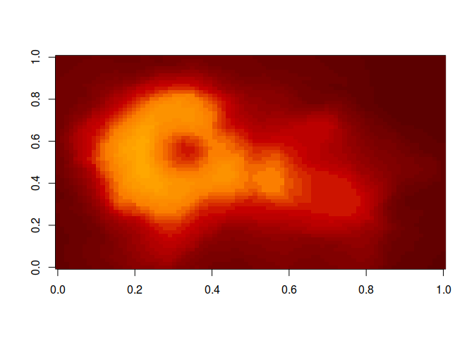
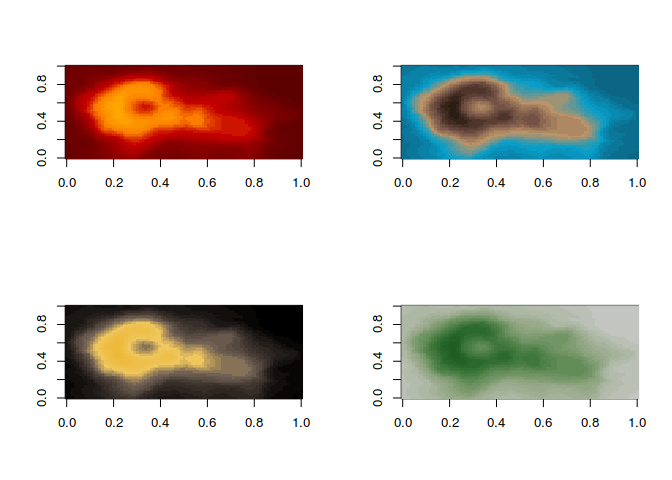

[](https://cran.r-project.org/package=harrypotter)
[](https://github.com/metacran/cranlogs.app)
[](https://github.com/metacran/cranlogs.app)
[](https://travis-ci.org/aljrico/harrypotter)
[](https://codecov.io/github/aljrico/harrypotter?branch=master)


I want to present you my first **R** package, [already published](https://cran.r-project.org/package=harrypotter) in CRAN. It has been very exciting and challenging.  

Now I appreciate that the way packages are organized, and the existence and structure of CRAN is one of the highlights of `R`, and one of the main reasons of its supremacy over other languages.


> “Most of us need to listen to the music to understand how beautiful it is. But often that’s how we present statistics: we just show the notes, we don’t play the music.” 

This package provides the first round of palettes derived from the *Harry Potter* film series.

At its first version, it simply contains the palettes of the [Hogwarts](https://en.wikipedia.org/wiki/Hogwarts) Houses. They have been chosen manually, taking into account its consistency with all the existing branding of the franchise, but its suitability for data visualisation. 

The colour palette should be beautiful, useful for plotting data and shoulr relate to desired style; in this case, should relate to the Harry Potter world. Some of the colours might change in future versions, in order to find this balance between suitability for plotting and relatable to the Harry Potter universe.


Installation
-------------

Just copy and execute this bunch of code and you'll have the last version of the package installed:


```r
install.packages("harrypotter")
```

And you can now use it:


```r
library(harrypotter)
```

Usage
-----

The default colour scale of the package is the one of the house *Hufflepuff*. If you prefer to choose another one, you'll need to specify which house you want the palette from.

Let's say that you want a palette made from the house **Gryffindor**.


```r
pal <- hp(25, house = "Gryffindor")
image(volcano, col = pal)
```

<!-- -->

Or a bit more like me, you prefer to be a **Ravenclaw**.


```r
pal <- hp(25, house = "Ravenclaw")
image(volcano, col = pal)
```

<!-- -->

Or put them all together


```r
pal_gryff <- hp(25, house = "Gryffindor")
pal_rav   <- hp(25, house = "Ravenclaw")
pal_huff  <- hp(25, house = "Hufflepuff")
pal_sly   <- hp(25, house = "Slytherin")

par(mfrow = c(2,2))
image(volcano, col = pal_gryff)
image(volcano, col = pal_rav)
image(volcano, col = pal_huff)
image(volcano, col = pal_sly)
```

<!-- -->

### ggplot2

Of course, this package has specific functions to behave seamlessly with the best data visiualisation library available. 
The package contains colour scale functions for **ggplot2** plots: `scale_color_hp()` and `scale_fill_hp()`.

Here is a made up example using the colours from the house of **Hufflepuff**,


```r
library(ggplot2)
ggplot(data.frame(x = rnorm(1e4), y = rnorm(1e4)), aes(x = x, y = y)) +
  geom_hex() + 
	coord_fixed() +
  scale_fill_hp(house = "hufflepuff") + 
	theme_bw()
```

<!-- -->

and **Slytherin**


```r
library(ggplot2)
ggplot(data.frame(x = rnorm(1e4), y = rnorm(1e4)), aes(x = x, y = y)) +
  geom_hex() + 
	coord_fixed() +
  scale_fill_hp(house = "slytherin") + 
	theme_bw()
```

<!-- -->


